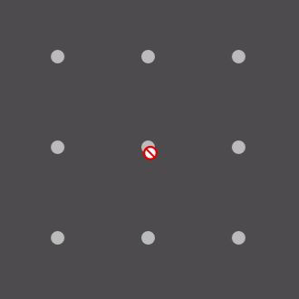
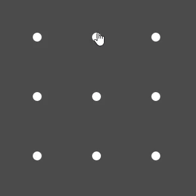
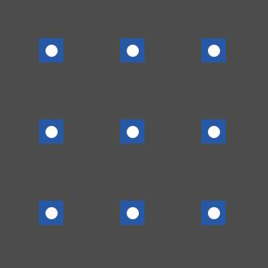

# React-Pattern-Lock
### Android's pattern lock
* Supports multiple sizes. eg : 2x2, 3x3, 4x4 -- 15x15.
* Supports touch screens.
* Many options to customize the input.

[](https://codesandbox.io/s/n5j7knjo54)

## Installation
```npm install react-pattern-lock```
## How to use

```javascript
import React, { Component } from "react";
import PatternLock          from "react-pattern-lock";

// in you render method
<PatternLock
	width={ 300 }
	pointSize={ 15 }
	size={ 3 }
	onChange={ (pattern) => {
		return new Promise((resolve, reject) => {
			setTimeout(() => pattern.join("") === "1340" ? resolve() : reject(), 1500);
		});
	}}
/>
```

### Props
| Prop | Type | Default | Definition |
| --- | --- | --- | --- |
| [size](#prop-size) | Number | Required | The size of the pattern input. |
| [width](#prop-width) | Number, String | Required | The width of the pattern wrapper. |
| [disabled](#prop-disabled) | Boolean | false | Disables the pattern input. |
| [invisible](#prop-invisible) | Boolean | false | Makes the lines that connect the points invisible. |
| [noPop](#prop-noPop) | Boolean | false | Disables the pop animation when a point gets activated. |
| [onChange](#prop-onChange) | Function | () => Promise.resolve() | A function that returns a Promise, the promise should resolve if the pattern was correct and reject otherwise. |
| errorColor | String | #F00 | The color used to indicate whenever a wrong pattern was drawn. |
| pointColor | String | #FFF | The color of the pattern points. |
| pointSize | Number | 10 | The size of the pattern points (used for width and height) in pixels. |
| [pointActiveSize](#prop-pointActiveSize) | Number | 30 | The size (in pixels) of the active area of the pattern points. |
| connectorWidth | Number | 2 | The thickness (in pixels) of the lines that connect the points. |
| connectorColor | String | #FFF | The color of the lines that connect the points. |
| className | String | | Any css classes that you might want to send to the wrapper. |
| style | Object | {} | Any css styles that you might want to send to the wrapper. |

----
### <a name="pattern-representation"></a> Pattern Representation

A pattern path is represented as an array of numbers.
for example :  
in a 3x3 pattern
the points are numbered starting from 0 top left, and ending in 8 bottom right.


So for example :


This would result in an array like this ```[1, 3, 4, 0]```.

----

### Detailed Props

#### <a name="prop-size"></a> size ```Number``` *REQUIRED*
The size of the pattern input
* 3 is 3x3 (9 points in total).
* 4 is 4x4 (16 points in total).
* etc.

The value should be between 3 and 15

#### <a name="prop-width"></a> width ```Number``` *REQUIRED*
The width of the pattern input's wrapper.  
Is the same as css's width property.  
eg : "100em", "100%".  
If the provided value had no unit, it will be considered as pixels.
This property is used to set the height of the pattern input's wrapper (to make a square).

#### <a name="prop-disabled"></a> disabled ```Boolean``` *default : false*
Makes the pattern input disabled (turns gray and user input is disabled).



#### <a name="prop-invisible"></a> invisible ```Boolean``` *default : false*
Hides the lines that connect the pattern points.


#### <a name="prop-noPop"></a> noPop ```Boolean``` *default : false*
Disables the pop animation when a point gets activated.



#### <a name="prop-onChange"></a> onChange ```Function``` *default : () => Promise.resolve()*
A function that returns a promise.
The function will get executed when the user releases the left mouse button (1 point must be selected at least).   
It will be given a ```pattern``` parameter, see [Pattern Representation](#pattern-representation) for more info.
for example
```js
// in your render method
<PatternLock
	onChange={(pattern) => {
		return new Promise((resolve, reject) => {
			Axios.post("/patternLogin", { pattern })
				.then(({ data }) => {
					if (data.success) resolve();
					else reject();
				}).catch(console.log);
		});
	}}
/>

// server side (express.js with bodyParser)
app.post("/patternLogin", (req, res) => {
	res.json({ success : req.body.pattern.join("-") === "1-3-4-0" });
});
```

#### <a name="prop-pointActiveSize"></a> pointActiveSize ```Number``` *default : 30*

The active area of each of the points.  
When the cursor enters this area the point will be activated.

Activate areas are indicated by the blue squares.




# License
MIT Licensed. Copyright (c) WinterCore 2018.